# Olist NLP Audit — Análise de Sentimentos, Embeddings & Modelagem de Tópicos

Projeto de Ciência de Dados para compreender avaliações de consumidores brasileiros por meio de **Processamento de Linguagem Natural, Machine Learning e análise de tópicos**.

O trabalho percorre a preparação dos dados, a comparação de representações textuais, o treinamento e a otimização de classificadores, a análise de generalização e a investigação dos assuntos presentes nos comentários.

Na auditoria final, **BoW com n-gramas + SVM alcançou F1 macro de 0,9188 e acurácia de 93,13%**. Os **embeddings + SVM identificaram mais avaliações negativas**, evidenciando que a escolha também depende do tipo de erro que se deseja reduzir.

Projeto desenvolvido como trabalho prático do módulo de NLP da **Pós-Tech em AI Scientist**.

---

## Objetivo do Projeto

> Como transformar avaliações de e-commerce em informações sobre satisfação dos clientes e temas recorrentes, comparando abordagens clássicas e representações semânticas?

Para responder a essa pergunta, foram exploradas:

- **TF-IDF e Bag of Words com n-gramas**, para representar palavras e suas combinações;
- **embeddings de sentenças**, para representar características semânticas dos comentários;
- **Naive Bayes, Regressão Logística e SVM**, para classificação de sentimentos;
- **LDA e NMF**, para descoberta de tópicos sem utilizar rótulos de sentimento no treinamento.

---

## Dataset

O projeto utiliza a tabela de avaliações do [Brazilian E-Commerce Public Dataset by Olist](https://www.kaggle.com/datasets/olistbr/brazilian-ecommerce), no arquivo `olist_order_reviews_dataset.csv`.

| Etapa de preparação | Quantidade |
|---|---:|
| Registros na base original | 99.224 |
| Avaliações com comentário preenchido | 40.977 |
| Avaliações após excluir a nota 3 | **37.420** |
| Avaliações positivas | 26.530 |
| Avaliações negativas | 10.890 |

As variáveis centrais são `review_comment_message`, que contém o texto, e `review_score`, que contém a nota. A coluna `sentimento` é criada a partir dessa nota.

**Os rótulos são derivados das avaliações numéricas, não de uma anotação manual dos textos.** Portanto, podem existir divergências entre o conteúdo de um comentário e o sentimento atribuído pela regra.

---

## Estrutura do Projeto

```text
olist-nlp-audit/
├── assets/
│   └── images/                       # Gráficos apresentados neste README
├── data/
│   ├── olist_order_reviews_dataset.csv
│   ├── dataset_tratado.csv
│   └── embedding/                    # Matrizes de embeddings salvas em .npy
├── models/
│   ├── modelo_tfidf_final.pkl
│   ├── modelo_bow_ngram_final.pkl
│   └── modelo_embeddings_final.pkl
├── notebooks/
│   ├── 01_data_preparation.ipynb
│   ├── 02_tfidf_models.ipynb
│   ├── 03_bow_ngram_models.ipynb
│   ├── 04_embeddings.ipynb
│   ├── 05_topic_modeling.ipynb
│   └── 06_final_nlp_audit.ipynb
├── .gitignore
├── requirements.txt
└── README.md
```

Os arquivos tratados, embeddings e modelos são produzidos ao executar os notebooks. Caso não estejam disponíveis na sua cópia do projeto, siga a sequência de execução ao final deste documento.

---

## 1. Validação e Preparação dos Dados

Notebook: [01_data_preparation.ipynb](notebooks/01_data_preparation.ipynb)

A preparação inclui inspeção da estrutura, verificação de valores ausentes e registros duplicados, seleção das colunas e remoção de avaliações sem comentário. Não foram encontrados registros inteiramente duplicados na verificação inicial; isso não significa ausência de textos repetidos.

### 1.1. Distribuição das Notas

A nota **5** predomina entre os comentários disponíveis. Essa concentração já indica que as classes de sentimento terão tamanhos diferentes.

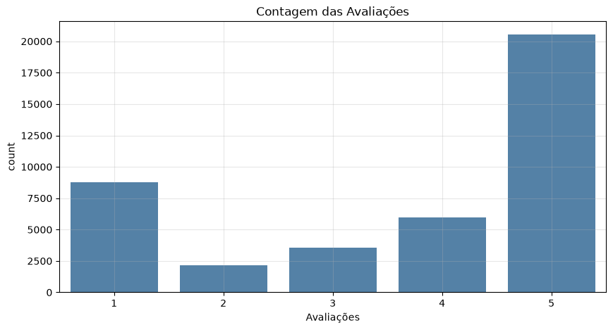

### 1.2. Definição dos Sentimentos

| Nota | Sentimento | Classe |
|---|---|---:|
| 1 ou 2 | Negativo | 0 |
| 3 | Excluída do problema binário | — |
| 4 ou 5 | Positivo | 1 |

A base final contém aproximadamente **70,9% de avaliações positivas** e **29,1% de negativas**. Esse desequilíbrio motiva o uso de estratificação, pesos de classe e métricas macro.

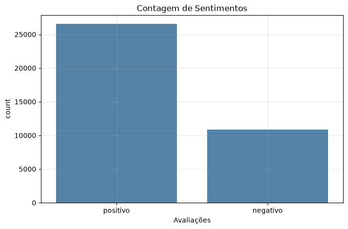

O resultado da preparação é salvo em `data/dataset_tratado.csv`, utilizado pelos demais experimentos.

---

## 2. Pré-processamento dos Textos

As etapas de limpeza incluem conversão para minúsculas, remoção de HTML, URLs e e-mails, expansão de abreviações e normalização de espaços.

O tratamento é adaptado à representação utilizada:

| Abordagem | Tratamento aplicado |
|---|---|
| TF-IDF e BoW | Tokenização, remoção de stopwords e stemização com RSLP |
| Embeddings | Preservação das palavras completas, stopwords e pontuação básica |
| Modelagem de tópicos | Tokenização e remoção de stopwords, sem stemização |

As listas de stopwords preservam termos de negação como **não, nunca e sem**, relevantes para interpretar insatisfação. Nos modelos lexicais, a stemização reduz as palavras a radicais; por exemplo, “produto” aparece como “produt” nos textos tratados.

---

## 3. Estratégia de Treinamento e Avaliação

Os experimentos supervisionados utilizam divisão estratificada com `random_state=42`:

```text
37.420 avaliações
        ↓
Treinamento: 26.194 (70%)
Teste:       11.226 (30%)
```

A otimização utiliza **GridSearchCV**, **StratifiedKFold com 5 divisões** e **F1 macro** como critério de seleção. Para TF-IDF e BoW, o vetorizador integra o pipeline avaliado na validação cruzada. Os embeddings são gerados por um modelo pré-treinado mantido fixo.

| Métrica | O que permite observar |
|---|---|
| Acurácia | Proporção total de classificações corretas |
| Precisão por classe | Quantas previsões daquela classe estavam corretas |
| Recall por classe | Quantos exemplos reais daquela classe foram identificados |
| F1 macro | Média do F1 das classes, com o mesmo peso para cada uma |
| Matriz de confusão | Quantidade e direção dos erros de classificação |

O teste também foi consultado durante a comparação dos modelos. Por isso, a auditoria final consolida resultados conhecidos e **não representa uma avaliação independente em dados novos**.

---

## 4. Modelos com TF-IDF

Notebook: [02_tfidf_models.ipynb](notebooks/02_tfidf_models.ipynb)

A primeira abordagem investiga quanto podemos aprender a partir da distribuição das palavras. O **TF-IDF** combina a frequência de um termo no comentário com sua ocorrência no conjunto de textos, reduzindo o peso de termos muito comuns entre os documentos.

Foram utilizados **unigramas e bigramas**, frequência mínima de 5 documentos, frequência máxima de 85% e limite de 10.000 características. A configuração `sublinear_tf=True` suaviza o efeito de repetições de uma mesma palavra.

### 4.1. Comparação e Escolha do Classificador

Com essa representação, comparamos **Naive Bayes Multinomial, Regressão Logística e SVM Linear**. Após o GridSearchCV, os melhores F1 macro médios na validação cruzada foram:

| Classificador otimizado | F1 macro de validação |
|---|---:|
| Naive Bayes | 0,9111 |
| Regressão Logística | 0,9122 |
| **SVM Linear** | **0,9132** |

O **SVM com C = 0,5** apresentou o maior valor entre as configurações testadas. A comparação no teste complementa essa escolha ao mostrar como os erros se distribuem entre as classes.

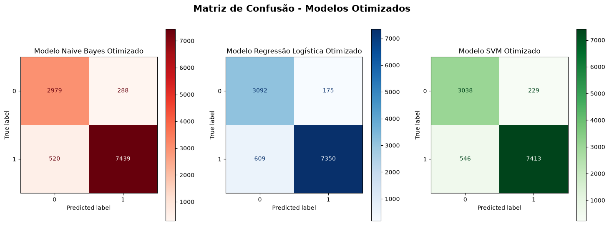

A Regressão Logística identificou mais avaliações negativas, mas classificou mais comentários positivos como negativos. O SVM apresentou **775 erros totais**, frente a **784 da Regressão Logística** e **808 do Naive Bayes**, oferecendo um compromisso entre os dois tipos de erro.

### 4.2. Resultado do SVM Selecionado

| Indicador | Resultado |
|---|---:|
| Acurácia | 93,10% |
| F1 macro | 0,9186 |
| F1 da classe negativa | 0,89 |
| F1 da classe positiva | 0,95 |

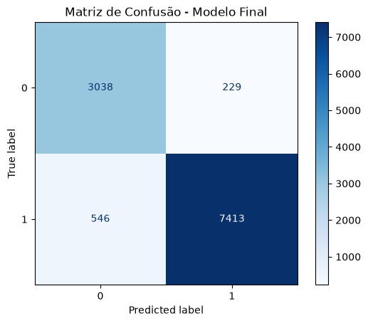

O modelo classificou corretamente **3.038 avaliações negativas** e **7.413 positivas**. Deixou passar **229 avaliações negativas** como positivas e gerou **546 falsos alertas**, ao prever sentimento negativo para comentários positivos.

O F1 inferior na classe negativa mostra que o desempenho não é uniforme entre os sentimentos. A acurácia global precisa, portanto, ser lida junto às métricas por classe.

### 4.3. Curva de Aprendizado

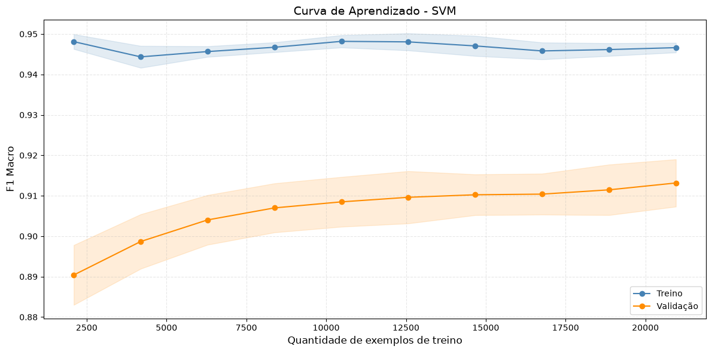

O desempenho de validação melhora com o aumento dos exemplos, enquanto o de treino permanece próximo de **0,95**. Ao final, a validação está próxima de **0,91**, com diferença calculada e arredondada de aproximadamente **0,03**.

A distância persistente entre as curvas indica algum sobreajuste: o modelo representa melhor os exemplos utilizados no ajuste do que os dados de validação. Ao mesmo tempo, a evolução da curva de validação sugere que mais dados podem trazer ganhos, sem garantir sua magnitude. Essa leitura é mais informativa do que concluir pela ausência de sobreajuste apenas com base na acurácia.

O pipeline selecionado reúne o vetorizador e o SVM em `modelo_tfidf_final.pkl`.

---

## 5. Modelos com Bag of Words e N-gramas

Notebook: [03_bow_ngram_models.ipynb](notebooks/03_bow_ngram_models.ipynb)

A segunda abordagem utiliza **contagens de palavras e pares de palavras**, por meio do `CountVectorizer`. Os bigramas permitem representar combinações locais de termos, enquanto os limites de frequência reduzem a presença de expressões muito raras ou excessivamente comuns.

Mantivemos frequência mínima de 5 documentos, frequência máxima de 85% e limite de 10.000 características. A diferença central em relação ao TF-IDF está na ponderação: aqui, a representação utiliza contagens.

### 5.1. Comparação e Escolha do Classificador

Também foram comparados **Naive Bayes, Regressão Logística e SVM**, com os seguintes resultados após a otimização:

| Classificador otimizado | F1 macro de validação |
|---|---:|
| Naive Bayes | 0,9090 |
| **Regressão Logística** | **0,9152** |
| SVM Linear | 0,9146 |

A Regressão Logística apresentou o maior F1 macro médio de validação. Entretanto, o projeto seguiu com o **SVM com C = 0,01** ao considerar a identificação de avaliações negativas na comparação do teste.


O SVM identificou **3.024 avaliações negativas**, contra **3.002 da Regressão Logística**. Essa diferença veio acompanhada de **24 falsos alertas adicionais** e **dois erros totais a mais**. A escolha expressa uma prioridade sobre o tipo de erro, e não uma vitória do SVM em todas as métricas.

Como essa decisão também considerou o teste, seu desempenho deve ser confirmado em uma nova amostra antes de uma adoção operacional.

### 5.2. Resultado do SVM Selecionado

| Indicador | Resultado |
|---|---:|
| Acurácia | 93,13% |
| F1 macro | 0,9188 |
| F1 da classe negativa | 0,89 |
| F1 da classe positiva | 0,95 |


Foram classificadas corretamente **3.024 avaliações negativas** e **7.431 positivas**. Os erros se distribuíram em **243 negativas previstas como positivas** e **528 positivas previstas como negativas**.

Esse resultado será a referência de maior F1 macro entre os três SVMs da auditoria final. A diferença para o TF-IDF, porém, é pequena e precisa ser interpretada na escala de quantidade de erros.

### 5.3. Curva de Aprendizado

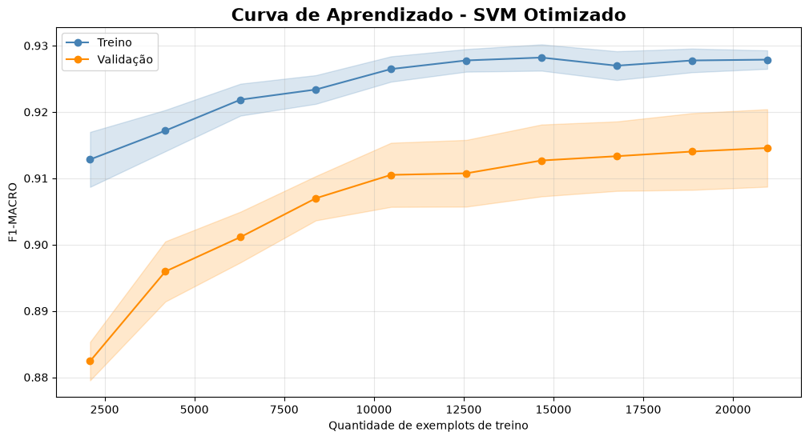

O F1 macro de validação cresce até aproximadamente **0,915**, enquanto o de treinamento chega a **0,928**, com diferença final de **0,013**. A menor separação entre as curvas sugere um ajuste menos distante do desempenho de validação do que no TF-IDF.

Os ganhos diminuem nas maiores amostras, indicando estabilização gradual. Isso não comprova que novos dados seriam inúteis, mas sugere avaliar também a qualidade dos exemplos, os erros recorrentes e a regularização.

O vetorizador e o SVM são salvos em `modelo_bow_ngram_final.pkl`.

---

## 6. Modelos com Embeddings

Notebook: [04_embeddings.ipynb](notebooks/04_embeddings.ipynb)

A terceira abordagem investiga se uma representação semântica oferece vantagens sobre as contagens e os pesos de palavras. Utilizamos o **paraphrase-multilingual-MiniLM-L12-v2** para transformar cada comentário em um vetor normalizado de **384 dimensões**.

O modelo de embeddings permanece pré-treinado, sem ajuste de seus pesos neste projeto. O aprendizado supervisionado ocorre nos classificadores que recebem esses vetores.

```text
Comentário tratado
        ↓
Sentence Transformer pré-treinado
        ↓
Embedding normalizado de 384 dimensões
        ↓
Regressão Logística ou SVM
        ↓
Sentimento previsto
```

### 6.1. Comparação e Escolha do Classificador

| Classificador otimizado | F1 macro de validação |
|---|---:|
| Regressão Logística | 0,9100 |
| **SVM Linear** | **0,9112** |

O **SVM com C = 10** apresentou uma pequena vantagem na validação cruzada e também cometeu menos erros no teste: **810**, contra **842** da Regressão Logística.

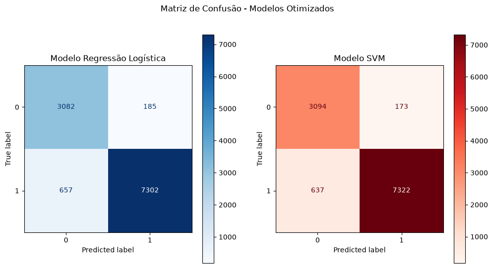

Em relação à Regressão Logística, o SVM reduziu os dois tipos de erro nessa amostra: **173 contra 185** negativas previstas como positivas e **637 contra 657** positivas previstas como negativas. Os resultados apoiam a escolha dentro dessa representação, sem demonstrar superioridade estatística.

### 6.2. Resultado do SVM Selecionado

| Indicador | Resultado |
|---|---:|
| Acurácia | 92,78% |
| F1 macro | 0,9159 |
| F1 da classe negativa | 0,88 |
| F1 da classe positiva | 0,95 |

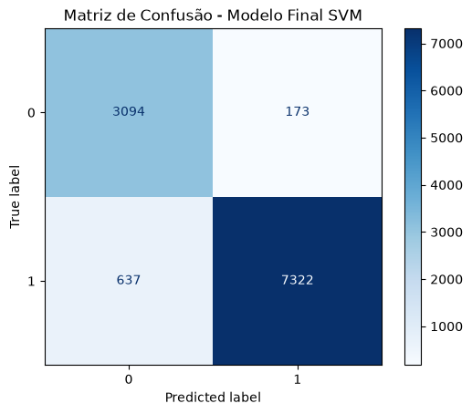

O modelo identificou corretamente **3.094 avaliações negativas** e **7.322 positivas**. O recall da classe negativa, próximo de **95%**, indica boa capacidade de localizar insatisfações. A precisão de aproximadamente **83%** nessa classe mostra o outro lado desse comportamento: parte dos comentários sinalizados como negativos é positiva.

Portanto, a sensibilidade aos negativos é uma vantagem relevante, mas precisa ser avaliada em conjunto com o volume de falsos alertas.

### 6.3. Curva de Aprendizado

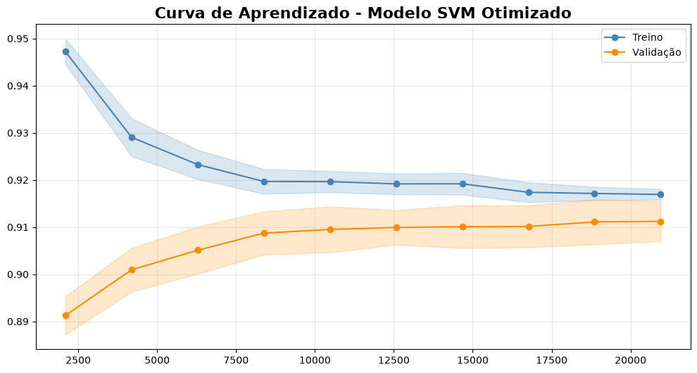

À medida que aumentamos o conjunto de treinamento, o desempenho de treino diminui e o de validação melhora. As curvas se aproximam, com resultados finais arredondados de **0,92 no treino**, **0,91 na validação** e diferença de **0,01**.

A pequena distância sugere baixo descompasso entre ajuste e validação nessa configuração. Contudo, **uma diferença menor não implica um modelo melhor**: o nível de validação permanece ligeiramente abaixo do BoW. A estabilização também sugere investigar a adequação da representação ao domínio, em vez de presumir que apenas aumentar a amostra resolverá os erros.

O arquivo `modelo_embeddings_final.pkl` contém o SVM treinado. Novas previsões também dependem da limpeza textual e do mesmo modelo de embeddings.

---

## 7. Auditoria Comparativa dos Três Modelos

Notebook: [06_final_nlp_audit.ipynb](notebooks/06_final_nlp_audit.ipynb)

Após a seleção de um SVM por representação, reunimos os resultados nas **mesmas 11.226 avaliações de teste**. A auditoria compara as soluções escolhidas em cada etapa; não é um ranking de todas as configurações experimentadas.

### 7.1. Desempenho Global

| Modelo | Acurácia | Precisão macro | Recall macro | F1 macro |
|---|---:|---:|---:|---:|
| TF-IDF + SVM | 93,10% | 0,9088 | 0,9307 | 0,9186 |
| **BoW + n-gramas + SVM** | **93,13%** | **0,9098** | 0,9296 | **0,9188** |
| Embeddings + SVM | 92,78% | 0,9031 | **0,9335** | 0,9159 |

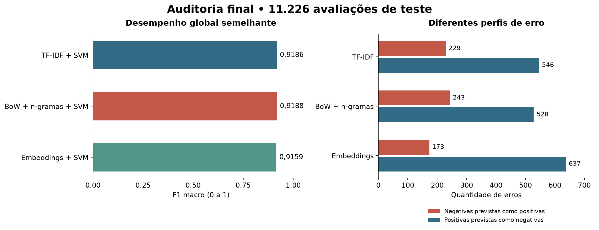

O **BoW com n-gramas** lidera o F1 macro observado, mas a diferença de **0,0002 para TF-IDF**, nos valores arredondados, é muito pequena. Na contagem absoluta, são **quatro acertos a mais** em mais de onze mil avaliações. Esses números favorecem a leitura de desempenhos próximos, sem justificar a afirmação de superioridade conclusiva.

Os embeddings não superaram as abordagens lexicais nessa métrica. Uma interpretação possível é que expressões locais de satisfação e insatisfação já ofereçam informação útil para esse conjunto de dados. O experimento, porém, não isola esse mecanismo nem permite generalizar o resultado para outros modelos de embeddings ou cenários.

### 7.2. O Tipo de Erro Muda a Decisão

Nas matrizes, **0 representa negativo** e **1 representa positivo**.

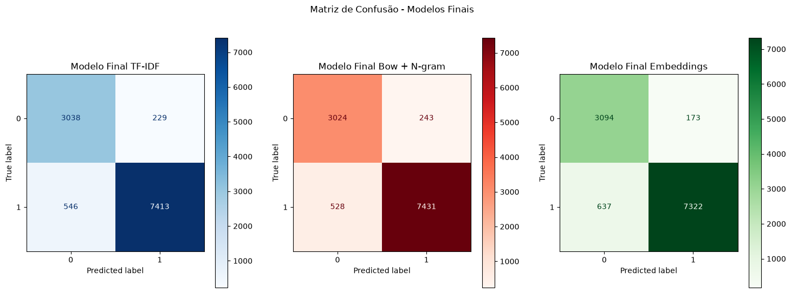

| Modelo | Negativas previstas como positivas | Positivas previstas como negativas | Total de erros |
|---|---:|---:|---:|
| TF-IDF + SVM | 229 | 546 | 775 |
| BoW + n-gramas + SVM | 243 | **528** | **771** |
| Embeddings + SVM | **173** | 637 | 810 |

Em comparação ao BoW, os embeddings deixam passar **70 avaliações negativas a menos**, uma redução de aproximadamente **28,8% nesse tipo de erro**. Em contrapartida, geram **109 falsos alertas adicionais** e cometem **39 erros totais a mais**.

Essa troca é relevante em uma fila de atendimento: identificar mais insatisfações pode ser desejável, desde que haja capacidade para revisar os alertas extras. Quando o objetivo é reduzir o total de classificações incorretas, os resultados observados favorecem o BoW.

O TF-IDF fica entre as duas alternativas: em relação ao BoW, deixa passar **14 negativas a menos**, mas produz **18 falsos alertas a mais**. Sua proximidade em F1 macro não significa que cometa exatamente os mesmos erros.

### 7.3. Generalização e Consistência

| Representação | F1 macro de validação do SVM no GridSearchCV | F1 macro no teste | Diferença treino–validação na curva |
|---|---:|---:|---:|
| TF-IDF | 0,9132 | 0,9186 | ≈ 0,03 |
| BoW + n-gramas | 0,9146 | 0,9188 | 0,013 |
| Embeddings | 0,9112 | 0,9159 | ≈ 0,01 |

Os três SVMs preservam a mesma ordem de F1 macro entre a validação e o teste. Essa consistência descritiva é útil, mas não substitui intervalos de confiança ou uma comparação estatística das previsões.

O TF-IDF apresenta a maior distância entre treino e validação. BoW e embeddings mostram diferenças menores, mas o menor intervalo dos embeddings não compensa automaticamente seu F1 de validação inferior. **A análise conjunta do nível de desempenho e da separação entre as curvas é mais informativa do que observar apenas um deles.**

As diferenças da última coluna foram calculadas nos notebooks antes do arredondamento; os valores exibidos para treino e validação podem, por isso, não reproduzir exatamente sua subtração. As faixas sombreadas das curvas representam variação entre divisões, não um teste de significância entre os modelos. Como os hiperparâmetros foram escolhidos com os mesmos dados de treinamento, essas curvas são diagnósticos do ajuste, e não uma validação externa.

### 7.4. Critério de Escolha para uma Aplicação

| Prioridade | Candidato a levar para nova validação | Justificativa observada |
|---|---|---|
| F1 macro e menor total de erros | **BoW + n-gramas + SVM** | Maior F1 macro e 771 erros |
| Reduzir insatisfações não identificadas | **Embeddings + SVM** | Apenas 173 negativas previstas como positivas |
| Alternativa lexical com desempenho próximo | **TF-IDF + SVM** | F1 macro praticamente igual ao BoW e menos negativas perdidas |

Para uma referência geral do projeto, seguimos com **BoW + n-gramas + SVM**, reconhecendo a proximidade do TF-IDF. Se a prioridade operacional mudar para recuperar mais avaliações negativas, os embeddings passam a merecer maior atenção.

Essa decisão ainda deve considerar o custo real de cada erro, a capacidade de revisão humana e o desempenho em novos dados. **Latência, memória e custo de inferência não foram medidos**, portanto não são utilizados aqui como vantagens comprovadas de uma abordagem.

---


## 8. Modelagem de Tópicos

Notebook: [05_topic_modeling.ipynb](notebooks/05_topic_modeling.ipynb)

Além de prever sentimentos, investigamos **sobre o que os consumidores escrevem**. Foram utilizados LDA sobre contagens de palavras e NMF sobre TF-IDF, sem utilizar os rótulos de sentimento no ajuste dos tópicos.

### 8.1. LDA e Número de Tópicos

| Número de tópicos | Coerência c_v |
|---|---:|
| 3 | 0,4323 |
| **5** | **0,4701** |
| 7 | 0,4513 |

A configuração com **5 tópicos** apresentou a maior coerência entre as alternativas testadas. Essa métrica auxilia a análise da associação entre palavras; não representa acurácia de classificação.

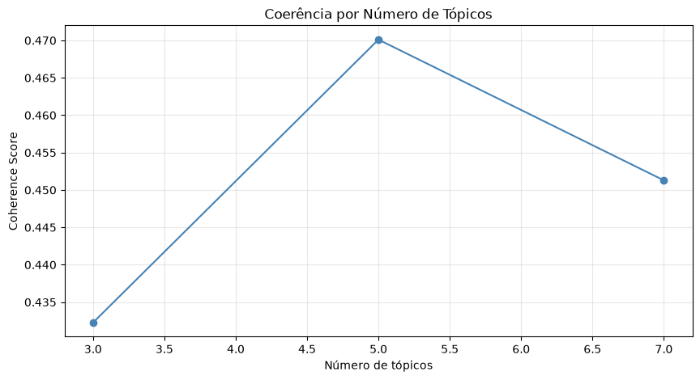

### 8.2. Interpretação dos Tópicos do NMF

O NMF utiliza uma matriz TF-IDF com **37.420 documentos e 3.158 termos**, organizada em cinco componentes. Sua coerência foi de **0,469**, próxima à do LDA, sem estabelecer uma vantagem conclusiva entre as abordagens.

Os tópicos receberam nomes a partir das palavras mais relevantes e da inspeção de comentários representativos:

| Tema interpretado | Avaliações | Sentimento negativo |
|---|---:|---:|
| Problemas de Recebimento | 14.802 | 64,5% |
| Qualidade e Satisfação | 8.222 | 8,0% |
| Entrega e Prazo | 7.464 | 5,5% |
| Recomendação e Experiência com a loja | 3.858 | 4,2% |
| Produto, preço e atendimento | 3.074 | 3,9% |

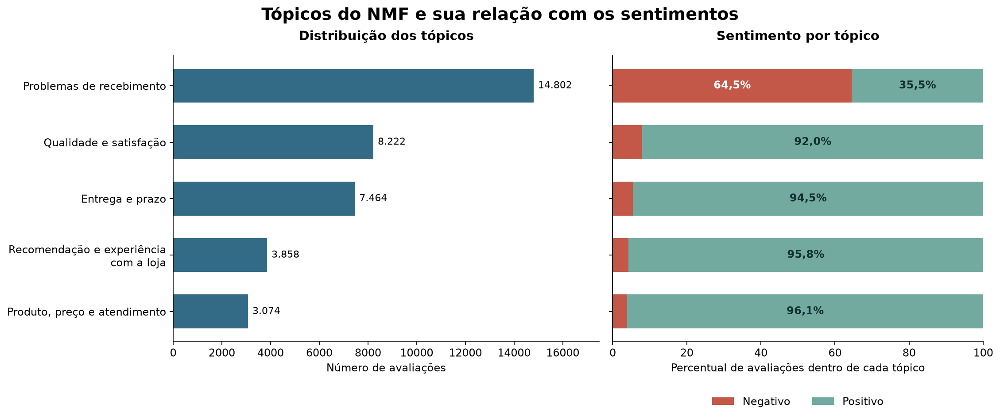

O grupo **Problemas de Recebimento** concentra a maior parcela de avaliações e apresenta predominância negativa, sugerindo uma prioridade de investigação. Entretanto, **35,5% dos comentários desse grupo são positivos**: o nome é uma interpretação temática, não uma confirmação de falha de entrega.

Cada documento recebe o tópico de maior peso. Esse peso não é uma probabilidade calibrada, e comentários curtos ou com vários assuntos podem exigir revisão manual.

---

## 9. Artefatos e Reutilização

| Arquivo | Conteúdo salvo | Entrada necessária |
|---|---|---|
| `modelo_tfidf_final.pkl` | Vetorizador TF-IDF e SVM | Texto já pré-processado |
| `modelo_bow_ngram_final.pkl` | CountVectorizer e SVM | Texto já pré-processado |
| `modelo_embeddings_final.pkl` | Classificador SVM | Embeddings gerados pelo mesmo modelo e normalização |

Os modelos são serializados com **Joblib**. A limpeza textual é executada separadamente; o classificador de embeddings também depende do Sentence Transformer. Portanto, os arquivos salvos ainda não formam um único fluxo de previsão a partir do texto bruto.

As matrizes de embeddings são armazenadas em `data/embedding/`. Sua reutilização exige manter a correspondência entre a ordem dos vetores, os textos e os rótulos.

---

## 10. Possíveis Aplicações

Os resultados podem apoiar a triagem de avaliações negativas, a identificação de temas recorrentes e o acompanhamento de problemas relatados pelos consumidores.

Uma aplicação futura poderia seguir o fluxo:

```text
Novas avaliações
        ↓
Validação e pré-processamento
        ↓
Classificação de sentimento + identificação de temas
        ↓
Revisão de casos ambíguos
        ↓
Dashboard de satisfação e prioridades de atendimento
```

Essa arquitetura é uma possibilidade de evolução. O escopo implementado neste repositório está nos notebooks e nos artefatos de modelagem.

---

## 11. Limitações e Próximas Evoluções

| Limitação observada | Próximo passo |
|---|---|
| Sentimentos derivados das notas e exclusão da nota 3 | Validar uma amostra manualmente e estudar a classe neutra |
| Teste consultado durante a comparação | Reservar novos dados para avaliação independente |
| Possibilidade de textos repetidos entre divisões | Auditar duplicatas textuais e avaliar separação por grupos |
| Pequenas diferenças entre modelos | Estimar incerteza e comparar previsões de forma pareada |
| Limpeza definida separadamente dos modelos | Centralizar o pré-processamento e verificar equivalência entre treino e inferência |
| Ausência de medição de latência e memória | Comparar custo de execução antes de uma escolha operacional |
| Tópicos atribuídos pelo maior peso | Revisar casos ambíguos, sem evidência temática ou com múltiplos assuntos |

Outras extensões incluem análise dos erros, integração com uma API ou dashboard, rastreamento de experimentos e monitoramento de mudanças no perfil dos comentários. **NER e BERTopic permanecem possibilidades futuras**, sem resultados apresentados nos seis notebooks atuais.

---

## 12. Tecnologias Utilizadas

**Python · Pandas · NumPy · NLTK · Scikit-learn · Sentence Transformers · Gensim · Matplotlib · Seaborn · Joblib · Jupyter Notebook**

---

## 13. Como Executar o Projeto

### 13.1. Ambiente

A partir da raiz do projeto, crie um ambiente virtual. O ambiente utilizado no desenvolvimento foi baseado em **Python 3.12**.

```powershell
python -m venv .venv
.\.venv\Scripts\Activate.ps1
python -m pip install -r requirements.txt
```

Em Linux ou macOS, a ativação equivalente é `source .venv/bin/activate`. O arquivo de dependências reflete o ambiente Windows e inclui `pywinpty`; ambientes de outros sistemas podem exigir adaptação dessa dependência.

### 13.2. Dados e Recursos

Baixe o dataset na página da Olist indicada acima e disponibilize `olist_order_reviews_dataset.csv` na pasta `data/`. Garanta a existência das pastas de saída:

```powershell
python -c "from pathlib import Path; [Path(p).mkdir(parents=True, exist_ok=True) for p in ['data/embedding', 'models']]"
python -m nltk.downloader punkt punkt_tab stopwords rslp
```

A primeira utilização dos embeddings requer acesso à internet para baixar o modelo pré-treinado. O recurso `rslp` é necessário para a stemização em português.

### 13.3. Ordem dos Notebooks

| Ordem | Notebook | Entrega principal |
|---|---|---|
| 1 | [Preparação dos dados](notebooks/01_data_preparation.ipynb) | Base tratada e rótulos de sentimento |
| 2 | [Modelos TF-IDF](notebooks/02_tfidf_models.ipynb) | Pipeline TF-IDF + SVM |
| 3 | [Modelos BoW e n-gramas](notebooks/03_bow_ngram_models.ipynb) | Pipeline BoW + SVM |
| 4 | [Embeddings](notebooks/04_embeddings.ipynb) | Vetores e classificador SVM |
| 5 | [Modelagem de tópicos](notebooks/05_topic_modeling.ipynb) | Temas e relação com os sentimentos |
| 6 | [Auditoria final](notebooks/06_final_nlp_audit.ipynb) | Comparação das representações |

Para respeitar os caminhos relativos `../data` e `../models`, execute os notebooks com o diretório de trabalho em `notebooks/`:

```powershell
cd notebooks
python -m jupyter lab
```

Execute cada notebook do início ao fim com o kernel do ambiente configurado. A auditoria final depende dos três arquivos de modelos produzidos nas etapas anteriores.

---

## 14. Conclusão

O projeto percorreu o caminho entre comentários brutos e uma análise comparativa de soluções de NLP: preparação da base, construção dos rótulos, tratamento linguístico, experimentação com representações textuais, otimização dos classificadores e interpretação dos erros.

O resultado central é que **as representações clássicas permaneceram competitivas neste problema**. O BoW com n-gramas alcançou o maior F1 macro entre os SVMs finais, enquanto o TF-IDF ficou a apenas quatro acertos de distância. Essa margem sustenta uma escolha de referência para o projeto, mas não uma conclusão de superioridade universal.

Os embeddings trouxeram uma contribuição diferente: **identificaram mais avaliações negativas**. Em relação ao BoW, recuperaram 70 insatisfações adicionais, acompanhadas de 109 falsos alertas a mais. A escolha entre essas soluções depende de quanto a aplicação valoriza localizar um cliente insatisfeito e de quanto custa revisar uma sinalização incorreta.

As curvas de aprendizado complementaram essa leitura. O TF-IDF manteve maior separação entre treino e validação; BoW e embeddings apresentaram diferenças menores, mas isso não tornou os embeddings superiores em F1 macro. O diagnóstico exige observar simultaneamente desempenho, generalização e natureza dos erros.

A modelagem de tópicos ampliou a análise ao relacionar os sentimentos aos assuntos discutidos. O grupo de recebimento concentrou avaliações negativas e se destacou como hipótese para investigação operacional, sem transformar a atribuição automática de um tema em evidência individual de falha de entrega.

**BoW + n-gramas + SVM permanece como referência geral; embeddings + SVM é o candidato quando a prioridade é deixar passar menos insatisfações.** O próximo passo é confirmar essa decisão em dados ainda não utilizados, revisar a qualidade dos rótulos e medir os custos de operação. Assim, a comparação deixa de se limitar a um ranking de métricas e passa a orientar uma escolha fundamentada para o uso real.

---

## Autor

**Renan Assis Trevelim**

Projeto de portfólio e aplicação prática de **Data Science, NLP, Machine Learning, análise de sentimentos e modelagem de tópicos**.

**LinkedIn:** [Renan Assis Trevelim](https://www.linkedin.com/in/renan-trevelim)  
**GitHub:** [RenanTrevelim](https://github.com/RenanTrevelim)

---

<sub>Resultados extraídos das saídas salvas dos notebooks. Os gráficos de comparação e de tópicos foram organizados a partir desses mesmos resultados; as demais figuras foram exportadas diretamente dos notebooks.</sub>
